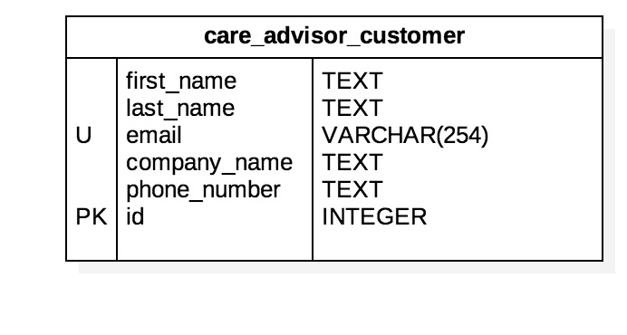

## Care Advisor Customer Backend API


## care_advisor_customer Table Entity Relationship Diagram




### Care Advisor Customer: Create, Update, and Delete Methods Endpoint
To create, update, or delete rows in the care_advisor_customer table of the database, make a PUT request to: http://picbackend.herokuapp.com/v2/care_advisor_customer/

- The header of the request should include: 
    - "Content-Type: "application/json""
    
The body of the request should be JSON formatted text using the following template:

```
"
{
    "full_name": String,
    "email": String (Must be in the following format: username@domanname.domain),
    "company_name": String,
    "phone_number": String (Must be in the following format: DDDDDDDDDD where D=base 10 digit),
    "id": Integer,
    "db_action": String,
}
"
```

In response, JSON formatted text with the following format will be returned in the response body:
```
{
 "Status": {
            "Error Code": Integer,
            "Version": 2.0,
            "Errors": Array
            "Data": {
                        "id": Integer or "deleted"
                    },
           }
}
```

In response, a JSON document will be displayed with the following format:
```
{
    "Status": {
            "Error Code": Integer,
            "Version": 2.0,
            "Errors": Array,
            "Warnings": Array,
           },
    "Data": Dictionary Object or "Deleted",
}
```

- Create a care_advisor_customer database row.
    - To create a row in the care_advisor_customer table, the value for "db_action" in the JSON Body must equal "create".
    
        - Keys that MUST be omitted:
            - "id"
        - Keys that CAN be omitted:
            - None
        - Keys that can be empty strings:
            - None
        - Keys that can be Null
            - None

    - If there are no errors in the JSON Body document:        
        - The response JSON document will have a dictionary object as the value for the "Data" key.
            - It contains the key "row", the value for which is an object with the fields of the created row.
    
- Update a care_advisor_customer database row.
    - To update a row in the care_advisor_customer table, the value for "db_action" in the JSON Body must equal "update".
    - All key value pairs in the JSON Body document correspond to updated fields for specified "id"
    - Note: at least one key other than "id" and "db_action" must be present
    
        - Keys that MUST be omitted:
            - None
        - Keys that CAN be omitted:
            - "full_name"
            - "email"
            - "company_name"
            - "phone_number"
        - Keys that can be empty strings:
            - None
        - Keys that can be Null
            - None
        
    - If there are no errors in the JSON Body document:
        - The response JSON document will have a dictionary object as the value for the "Data" key.
            - It contains the key "row", the value for which is an object with the fields of the updated row.

- Delete a care_advisor_customer database row.
    - To delete a row in the care_advisor_customer table, the value for "db_action" in the JSON Body must equal "delete".
    
        - Keys that can be omitted:
            - all except "id" and "db_action"
        
    - If there are no errors in the JSON Body document:
        - The response JSON document will have a dictionary object as the value for the "Data" key.
            - It contains the key "row", the value for which is "Deleted".
    
- If there are errors in the JSON Body document:
    - "Error Code" will be 1.
    - An array of length > 0 will be the value for the "Errors" key in the "Status" dictionary.
        -Each item in the array is a string corresponding to an error in the JSON Body doc.
    - No changes are made to the database.
    
### Care Advisor Customer: Read Method Endpoint
- To read/query rows in the care_advisor_customer table of the database, make a GET request to http://picbackend.herokuapp.com/v2/care_advisor_customer/
    - Results returned in the response body will be filtered by the parameters given in the query string of the request url.
    - The parameters given in the REQUIRED query string can be divided into 2 categories: "primary" and "secondary"
    
    - "primary" parameters - One and exactly one of these parameters are required in every request query string.
        - "full_name" corresponds to the full_name column of the care_advisor_customer table.
            - Must be an ascii string that has all non-ascii characters url encoded
        - "email" corresponds to the email column of the care_advisor_customer table.
            - Must be a string
            - Can be multiple values separated by commas.
        - "company_name" corresponds to the company_name column of the care_advisor_customer table.
            - Must be an ascii string that has all non-ascii characters url encoded
        - "phone_number" corresponds to the column of the care_advisor_customer table.
            - Must be an integer
            - Must be in the following format: DDDDDDDDDD where D=base 10 digit
            - Can be multiple values separated by commas.
        - "id" corresponds to the id column of the care_advisor_customer table.
            - Must be an integer
            - Can be multiple values separated by commas.
            - passing "all" as the value will return all rows.
            
    - "Secondary" parameters - Any number of these parameters can be added to a request query string.
        - None
    
- The response body will be a JSON formatted text with the following format:
    ```
    {
        "Data": [
            {
                "full_name": String,
                "email": String,
                "company_name": String,
                "phone_number": String,
                "id": Integer,
            },
            ...,
            ...,
            ...,
        ],
        "Status": {
            "Version": 2.0,
            "Error Code": Integer,
            "Errors": Array
        }
    }
    ```

- NOTES
    - If the 'primary' parameter given in the query string is not 'id', results will be grouped by the 'primary' parameter that is given with the request.
        -Eg: If "full_name" is the "primary" parameter the results will be grouped like the following
            
            ```
            "Data": [
                [Results for full_name parameter 2],
                [Results for full_name parameter 1],
                [Results for full_name parameter 3],
                ...,
            ] (Order is arbitrary)
            ```
  
- If there ARE NO errors parsing the request body and rows in the care_advisor_customer table of the database ARE found:
    - The value for the "Errors" key in the response root object will an empty array
    - The value for the "Error Code" key in the response root object will be 0. 
- If there ARE errors parsing the request body or rows in the care_advisor_customer table of the database ARE NOT found,
    - "Error Code" will be 1.
    - An array of length > 0 will be the value for the "Errors" key in the "Status" object.
        -Each item in the array is a string corresponding to an error parsing the JSON Body doc.
    - An empty array will be the value for the "Data" key.
