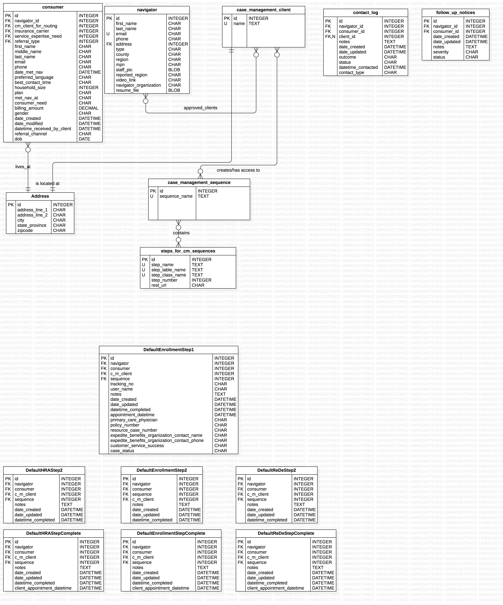

# Case Management Module Backend API

## Entity Relationship Diagram for Case Management Module related data models

## Case Management Client Backend API README
[Case Management Client Endpoints API README](case_management_client/README.md)

## Contact Log Backend API README
[Contact Log Endpoints API README](contact_log/README.md)

## Follow Up Notices Backend API README
[Follow Up Notices Endpoints API README](follow_up_notices/README.md)

## Case Management Sequences Backend API README
[Case Management Sequences Endpoints API README](sequences/README.md)

## Steps for CM Sequences Backend API README
[Steps for CM Sequences Endpoints API README](steps_for_cm_sequences/README.md)
    - Individual Steps for Case Management Sequences Endpoints README
    - [Individual Steps for Case Management Sequences Endpoints Endpoints README](steps_for_cm_sequences/individual_sequence_steps/README.md)
