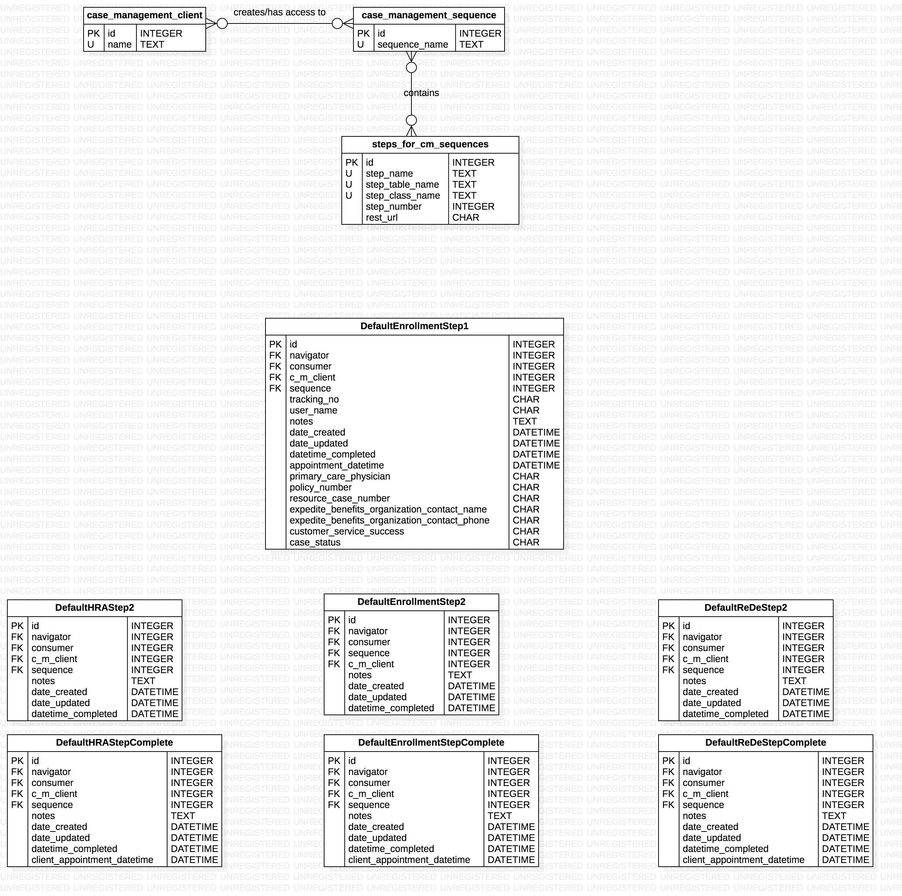

# Case Management Sequences Backend API README


## Entity Relationship Diagram for Case Management Sequences related data models




### Modify Case Management Sequences Table Rows
To create, update, or delete a row in the CMSequences table of the database, make a PUT request to: http://picbackend.herokuapp.com/v2/cm_sequences/.

- The headers of the request MUST include: 
    - "Content-Type: "application/json""
    - "X-Requested-With: "XMLHttpRequest"""
    
The body of the request must be a JSON document using the following template:

```
{
    "name": String,
    "add_steps": [
        Integer,
        ...
    ](Rows with id's must exist in StepsForCMSequences table and not in given CMSequences row's steps column. Sequence must also have a row with a preceding step_number in order to add a row. Eg. in order to ad a row with step_number 2, there must exist a step row with step_number 1 in the sequence's steps column.),
    "remove_steps": [
        Integer,
        ...
    ](Rows with id's must exist in StepsForCMSequences table and in given CMSequences row's steps column),
    
    "db_action": String,
    "id": Integer,
}
```

In response, a JSON document will be displayed with the following format:
```
{
    "Status":
        {
            "Error Code": Integer,
            "Version": 2.0,
            "Errors": Array
            "Data": Object or "Deleted",
        }
}
```

- Create a CMSequences database row.
    - To create a row in the CMSequences table, the value for "db_action" in the JSON Body must equal "create".
    
        - Keys that can be omitted:
            - "id"
            - "add_steps"
            
        - Keys that can be empty strings:
            - "name"
            
        - Keys that can be empty arrays:
            - "add_steps"
        
        - Keys that can be Null
            - None
            
        - Keys that will NOT be read:
            - "remove_steps"

    - If there are no errors in the JSON Body document:        
        - The response JSON document will have a dictionary object as the value for the "Data" key.
            - It contains the key "row", the value for which is an object with the fields of the created row.
    
- Update a CMSequences database row.
    - To update a row in the CMSequences table, the value for "db_action" in the JSON Body must equal "update".
    - All key value pairs in the JSON Body document correspond to updated fields for specified "id"
    - Note: at least one key other than "id" and "db_action" must be present
    
        - Keys that can be omitted:
            - all except "id" and "db_action"
        
        - Keys that can be empty strings:
            - "name"
            
        - Keys that can be empty arrays:
            - "add_steps"
        
        - Keys that can be Null
            - None
        
    - If there are no errors in the JSON Body document:
        - The response JSON document will have a dictionary object as the value for the "Data" key.
            - It contains the key "row", the value for which is an object with the fields of the updated row.

- Delete a CMSequences database row.
    - To delete a row in the CMSequences table, the value for "db_action" in the JSON Body must equal "delete".
    
        - Keys that can be omitted:
            - all except "id" and "db_action"
        
    - If there are no errors in the JSON Body document:
        - The response JSON document will have a dictionary object as the value for the "Data" key.
            - It contains the key "row", the value for which is "Deleted".
    
    
### Case Management Sequences Data Retrieval API
- To read rows from the CMSequences table of the backend, make a GET request to http://picbackend.herokuapp.com/v2/cm_sequences/
    - Results will be filtered by the given parameters.
    - Parameters are divided into 2 categories: "primary" and "secondary"
    
    - "Primary" parameters - One and exactly one of these parameters are required in every request.
        - "id" corresponds to database id.
            - Must be an integer
            - Can be multiple values separated by commas.
            - passing "all" as the value will return all staff members.
        - "name" corresponds to the company_name column of the NavOrgsFromOnlineForm table.
            - Must be an ascii string that has all non-ascii characters url encoded
            
    - "Secondary" parameters - Any number of these parameters can be added to a request.
        - None
        
- The response will be a JSON document with the following format:
    ```
    {
        "Data": [
            {
                 "name": String,
                 "steps": [
                    {
                        "step_name": String,
                        "step_table_name": String,
                        "step_class_name": String,
                        "step_number": Integer,
                        "id": Integer,
                    },
                    ...
                 ],
                 "id": Integer,
            },
            ...,
            ...,
            ...,
        ],
        "Status": {
            "Version": 2.0,
            "Error Code": Integer,
            "Errors": Array
        }
    }
    ```

- If CMSequences table rows are found,
    - "Error Code" will be 0
    - Array corresponding to the "Data" key will be non empty.
- If CMSequences table rows are not found,
    - "Error Code" will be 1.
    - An array of length > 0 will be the value for the "Errors" key in the "Status" dictionary.
        -Each item in the array is a string corresponding to an error in the JSON Body doc.
    - Array corresponding to the "Data" key will be empty.
