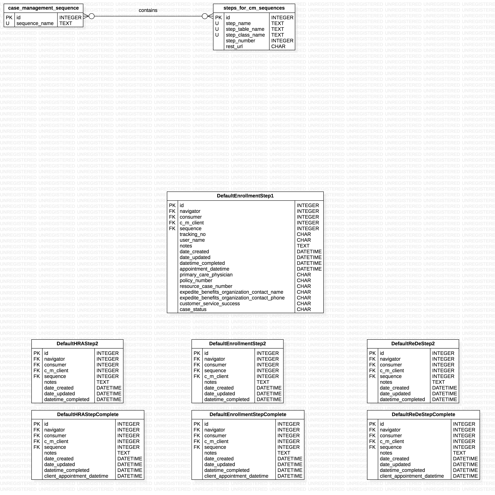

# Steps for CM Sequences Backend API README
- The StepsForCMSequences table is responsible for recording which tables in the database correspond to a given sequence step and mapping those steps to sequences.


## Entity Relationship Diagram for "Steps for CM Sequences" related data models




### Modify Steps for CM Sequences Table Rows
To create, update, or delete a row in the StepsForCMSequences table of the database, make a PUT request to: http://picbackend.herokuapp.com/v2/steps_for_cm_sequences/.

- The headers of the request MUST include: 
    - "Content-Type: "application/json""
    - "X-Requested-With: "XMLHttpRequest"""
    
The body of the request must be a JSON document using the following template:

```
{
    "step_name": String,
    "step_table_name": String (Table MUST be present in db schema. When creating a new row, will be set to the _meta.db_table value of the associated class if it is present in class meta values and key is not present in request.),
    "step_class_name": String (Class model for Table MUST be present in db schema.),
    "step_number": Integer (Must be > than 0),
    "rest_url": String (url for REST API. When creating a new row, will be set to the _meta.rest_url value of the associated class if it is present in class meta values and key is not present in request.),
    
    "db_action": String,
    "id": Integer,
}
```

In response, a JSON document will be displayed with the following format:
```
{
    "Status":
        {
            "Error Code": Integer,
            "Version": 2.0,
            "Errors": Array
            "Data": Object or "Deleted",
        }
}
```

- Create a StepsForCMSequences database row.
    - To create a row in the StepsForCMSequences table, the value for "db_action" in the JSON Body must equal "create".
    
        - Keys that can be omitted:
            - "id"
            - "step_table_name"
            
        - Keys that can be empty strings:
            - "step_table_name"
        
        - Keys that can be Null
            - "step_table_name"

    - If there are no errors in the JSON Body document:        
        - The response JSON document will have a dictionary object as the value for the "Data" key.
            - It contains the key "row", the value for which is an object with the fields of the created row.
    
- Update a StepsForCMSequences database row.
    - To update a row in the StepsForCMSequences table, the value for "db_action" in the JSON Body must equal "update".
    - All key value pairs in the JSON Body document correspond to updated fields for specified "id"
    - Note: at least one key other than "id" and "db_action" must be present
    
        - Keys that can be omitted:
            - all except "id" and "db_action"
        
        - Keys that can be empty strings:
            - "step_table_name"
        
        - Keys that can be Null
            - "step_table_name"
        
    - If there are no errors in the JSON Body document:
        - The response JSON document will have a dictionary object as the value for the "Data" key.
            - It contains the key "row", the value for which is an object with the fields of the updated row.

- Delete a StepsForCMSequences database row.
    - To delete a row in the StepsForCMSequences table, the value for "db_action" in the JSON Body must equal "delete".
    
        - Keys that can be omitted:
            - all except "id" and "db_action"
        
    - If there are no errors in the JSON Body document:
        - The response JSON document will have a dictionary object as the value for the "Data" key.
            - It contains the key "row", the value for which is "Deleted".
    
    
### Steps for CM Sequences Data Retrieval API
- To read rows from the StepsForCMSequences table of the backend, make a GET request to http://picbackend.herokuapp.com/v2/steps_for_cm_sequences/
    - Results will be filtered by the given parameters.
    - Parameters are divided into 2 categories: "primary" and "secondary"
    
    - "Primary" parameters - One and exactly one of these parameters are required in every request.
        - "id" corresponds to database id.
            - Must be an integer
            - Can be multiple values separated by commas.
            - passing "all" as the value will return all staff members.
        - "name" corresponds to the company_name column of the NavOrgsFromOnlineForm table.
            - Must be an ascii string that has all non-ascii characters url encoded
            
    - "Secondary" parameters - Any number of these parameters can be added to a request.
        - None
        
- The response will be a JSON document with the following format:
    ```
    {
        "Data": [
            {
                "step_name": String,
                "step_table_name": String,
                "step_class_name": String,
                "step_number": Integer,
                "rest_url": String,
            },
            ...,
            ...,
            ...,
        ],
        "Status": {
            "Version": 2.0,
            "Error Code": Integer,
            "Errors": Array
        }
    }
    ```

- If StepsForCMSequences table rows are found,
    - "Error Code" will be 0
    - Array corresponding to the "Data" key will be non empty.
- If StepsForCMSequences table rows are not found,
    - "Error Code" will be 1.
    - An array of length > 0 will be the value for the "Errors" key in the "Status" dictionary.
        -Each item in the array is a string corresponding to an error in the JSON Body doc.
    - Array corresponding to the "Data" key will be empty.
    
    
## Individual Steps for Case Management Sequences Endpoints
- There are HTTP REST endpoints for each row in the StepsForCMSequences table, stored in the 'rest_url' column.
They correspond to the endpoints used to modify and read case management sequence steps for consumers and consequently,
manage case management sequences from the perspective of navigators and consumers. Below is the documentation for those
endpoints. 

### Individual Steps for Case Management Sequences Endpoints README
[Individual Steps for Case Management Sequences Endpoints Endpoints README](individual_sequence_steps/README.md)
