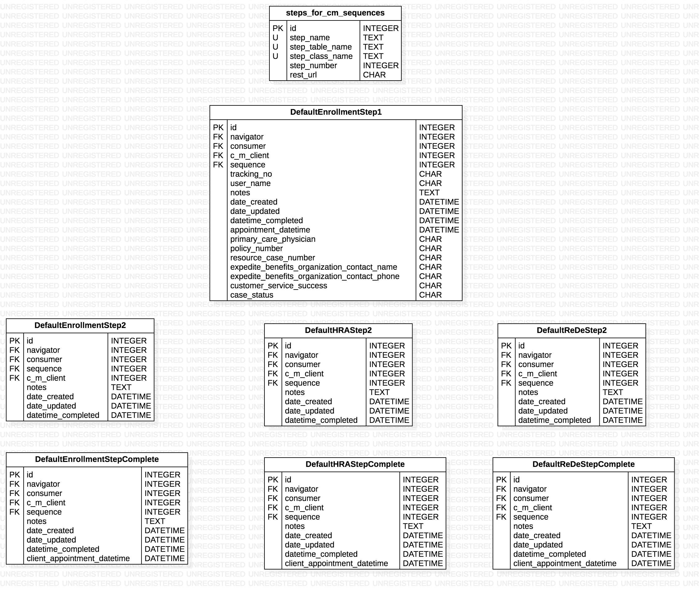

# Individual Steps for Case Management Sequences README

## Entity Relationship Diagram for Individual Steps for Case Management Sequences related data models

## Default Enrollment Step 1 API README
- StepsForCMSequences table row id: 1
[Default Enrollment Step 1 Endpoints README](default_enrollment_step_1/README.md)

## Default Enrollment Step 2 API README
- StepsForCMSequences table row id: 2
[Default Enrollment Step 2 Endpoints README](default_enrollment_step_2/README.md)

## Default Enrollment Step Complete API README (IN DEVELOPMENT)
- StepsForCMSequences table row id: 3
[Default Enrollment Step Complete Endpoints README](default_enrollment_step_complete/README.md)
