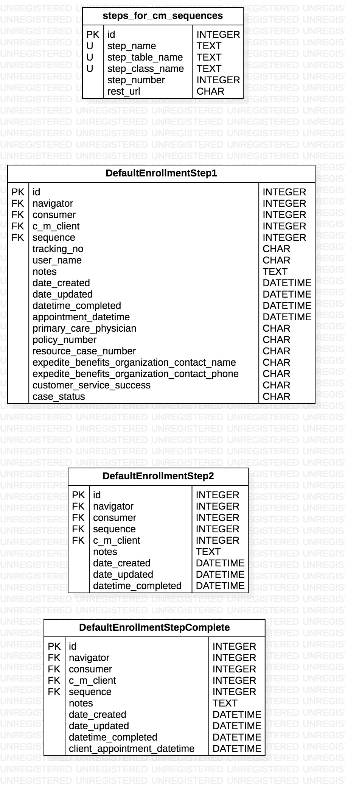

# Default Enrollment Step 2 Backend API README (IN DEVELOPMENT)
- Note: Row id 2 of the StepsForCMSequences table corresponds to this table, DefaultEnrollmentStep2. The step_class_name
of row id 2 of the StepsForCMSequences table is DefaultEnrollmentStep2.

## Entity Relationship Diagram for Default Enrollment Step 2 related data models




### Modify Default Enrollment Step 2 Table Rows (IN DEVELOPMENT)
To create, update, or delete a row in the DefaultEnrollmentStep2 table of the database, make a PUT request to: http://picbackend.herokuapp.com/v2/default_enrollment_step_2/.

- The headers of the request MUST include: 
    - "Content-Type: "application/json""
    - "X-Requested-With: "XMLHttpRequest"""
    
The body of the request must be a JSON document using the following template:

```
{
    "consumer_id": Integer (id of row in PICConsumers table),
    "navigator_id": Integer (id of row in Navigators table),
    "cm_client_id": Integer (id of row in Case Management Clients table),
    "cm_sequence_id": Integer (id of row in CMSequences table),
    (Only 1 row with a given consumer, cm_client, and cm_sequence combination can exist in the table at once. An error will be returned if a duplicate will be created by creation or modification.)
    
    "user_name": String,
    "tracking_no": String,
    "notes": String,
    "datetime_completed": String (Must be a iso formatted date and time in UTC eg. 'YYYY-MM-DDTHH:MM:SS'),
    
    "db_action": String,
    "id": Integer,
}
```

In response, a JSON document will be displayed with the following format:
```
{
    "Status":
        {
            "Error Code": Integer,
            "Version": 2.0,
            "Errors": Array
            "Data": Object or "Deleted",
        }
}
```

- Create a DefaultEnrollmentStep1 database row.
    - To create a row in the DefaultEnrollmentStep1 table, the value for "db_action" in the JSON Body must equal "create".
    
        - Keys that can be omitted:
            - "id"
            - "notes"
            - "datetime_completed"
            - "user_name"
            - "tracking_no"
            
        - Keys that can be empty strings:
            - "notes"
            - "user_name"
            - "tracking_no"
        
        - Keys that can be Null
            - "notes"
            - "datetime_completed"
            - "user_name"
            - "tracking_no"

    - If there are no errors in the JSON Body document:        
        - The response JSON document will have a dictionary object as the value for the "Data" key.
            - It contains the key "row", the value for which is an object with the fields of the created row.
    
- Update a DefaultEnrollmentStep1 database row.
    - To update a row in the DefaultEnrollmentStep1 table, the value for "db_action" in the JSON Body must equal "update".
    - All key value pairs in the JSON Body document correspond to updated fields for specified "id"
    - Note: at least one key other than "id" and "db_action" must be present
    
        - Keys that can be omitted:
            - all except "id" and "db_action"
        
        - Keys that can be empty strings:
            - "notes"
            - "user_name"
            - "tracking_no"
        
        - Keys that can be Null
            - "notes"
            - "datetime_completed"
            - "user_name"
            - "tracking_no"
        
    - If there are no errors in the JSON Body document:
        - The response JSON document will have a dictionary object as the value for the "Data" key.
            - It contains the key "row", the value for which is an object with the fields of the updated row.

- Delete a DefaultEnrollmentStep1 database row.
    - To delete a row in the DefaultEnrollmentStep1 table, the value for "db_action" in the JSON Body must equal "delete".
    
        - Keys that can be omitted:
            - all except "id" and "db_action"
        
    - If there are no errors in the JSON Body document:
        - The response JSON document will have a dictionary object as the value for the "Data" key.
            - It contains the key "row", the value for which is "Deleted".
    
    
### Default Enrollment Step 1 Data Retrieval API (IN DEVELOPMENT)
- To read rows from the DefaultEnrollmentStep1 table of the backend, make a GET request to http://picbackend.herokuapp.com/v2/default_enrollment_step_1/
    - Results will be filtered by the given parameters.
    - Parameters are divided into 2 categories: "primary" and "secondary"
    
    - "Primary" parameters - One and exactly one of these parameters are required in every request.
        - "id" corresponds to database id.
            - Must be an integer
            - Can be multiple values separated by commas.
            - passing "all" as the value will return all staff members.
            
    - "Secondary" parameters - Any number of these parameters can be added to a request.
        - "nav_id" corresponds to the Navigators table database id of the 'navigator' column.
            - Must be an integer
            - Can be multiple values separated by commas.
        - "consumer_id" corresponds to the PICConsumer table database id of the 'consumer' column.
            - Must be an integer
            - Can be multiple values separated by commas.
        - "cm_client_id" corresponds to the CaseManagementClient table database id of the 'cm_client' column.
            - Must be an integer
            - Can be multiple values separated by commas.
            - passing "all" as the value will return all rows with a non null value for cm_client.
            - passing "none" as the value will return all consumer rows with a null value for cm_client_for_routing.
        - "cm_sequence_id" corresponds to the CaseManagementSequences table database id of the 'cm_sequence' column.
            - Must be an integer
            - Can be multiple values separated by commas.
            - passing "all" as the value will return all rows with a non null value for cm_client.
        - "user_name" corresponds to the user_name column.
            - Must be an ascii string that has all non-ascii characters url encoded
        - "tracking_no" corresponds to the tracking_no column.
            - Must be an ascii string that has all non-ascii characters url encoded
        - "date_created_start" - Start date of the date_created column (inclusive)
            - Must be given in "YYYY-MM-DD" format
        - "date_created_end" - End date of the date_created column (inclusive)
            - Must be given in "YYYY-MM-DD" format
        - "date_modified_start" - Start date of the date_modified column (inclusive)
            - Must be given in "YYYY-MM-DD" format
        - "date_modified_end" - End date of the date_modified column (inclusive)
            - Must be given in "YYYY-MM-DD" format
        - "datetime_completed_start_date" - Start date of the datetime_completed column (inclusive)
            - Must be given in "YYYY-MM-DD" format
        - "datetime_completed_end_date" - End date of the datetime_completed column (inclusive)
            - Must be given in "YYYY-MM-DD" format
        
- The response will be a JSON document with the following format:
    ```
    {
        "Data": [
            {
                "consumer": Integer,
                "navigator": Integer,
                "cm_client": Integer,
                "cm_sequence": Integer,
                
                "user_name": String,
                "tracking_no": String,
                "notes": String,
                "datetime_completed": String,
                "date_created": String,
                "date_modified": String,
                
                "id": Integer,
            },
            ...,
            ...,
            ...,
        ],
        "Status": {
            "Version": 2.0,
            "Error Code": Integer,
            "Errors": Array
        }
    }
    ```

- If DefaultEnrollmentStep1 table rows are found,
    - "Error Code" will be 0
    - Array corresponding to the "Data" key will be non empty.
- If DefaultEnrollmentStep1 table rows are not found,
    - "Error Code" will be 1.
    - An array of length > 0 will be the value for the "Errors" key in the "Status" dictionary.
        -Each item in the array is a string corresponding to an error in the JSON Body doc.
    - Array corresponding to the "Data" key will be empty.
