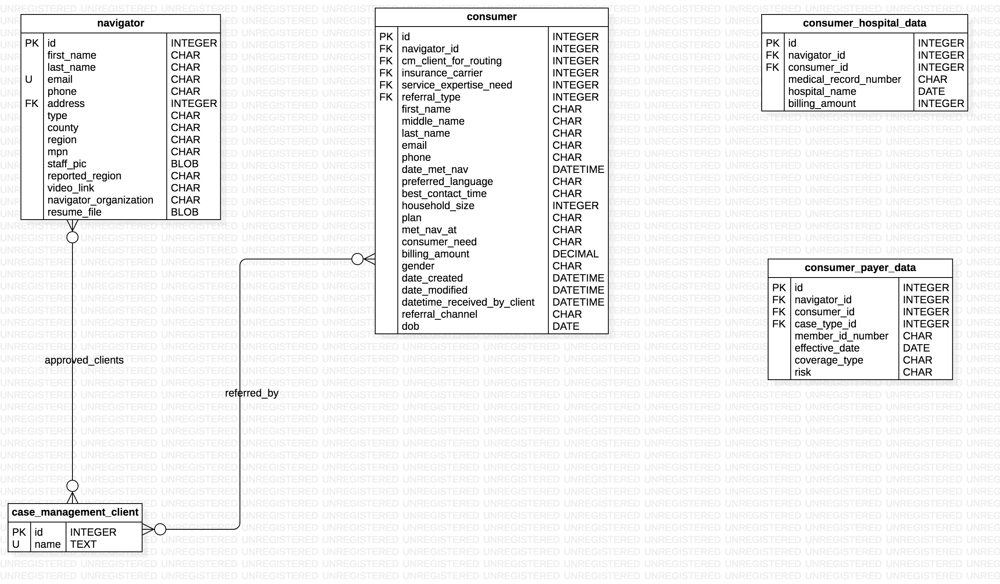

## Consumer Tables Endpoints README (IN DEVELOPMENT)


## Entity Relationship Diagram for Consumer related data models




### Modify Consumer Table Rows (IN DEVELOPMENT)
To create, update, or delete rows in the PICConsumer table of the database, make a PUT request to: http://picbackend.herokuapp.com/v2/consumers/.

- The headers of the request should include: 
    - "Content-Type: "application/json""
    
The body of the request should be a JSON document using the following template:

```
{
    "first_name": String,
    "middle_name": String,
    "last_name": String,
    "email": String,
    "phone": String,
    "met_bav_at": String,
    "household_size": Integer,
    'gender': String,
    "dob": String (Must be a iso formatted date 'YYYY-MM-DD'),
    'referral_channel': String,
    'referral_type': String  (A row in the HealthcareServiceExpertise table with a name equal to the value of this key must exist in the db),
    "consumer_notes": [
        "These are",
        "sample notes",
        "navigators write about consumers",
        ...
    ],
    "plan": String,
    "preferred_language": String,
    "best_contact_time": String,
    
    "navigator_id": Integer (A row in the Navigators table with an id equal to the value of this key must exist in the db),
    "cm_client_id_for_routing": Integer (A row in the CMClients table with an id equal to the value of this key must exist in the db),
    # NOTE: A consumer can either have a navigator that its assigned to, or a cm_client_for_routing that its assigned to. Not Both or None Exceptions will be given if you try to assign both or none of them.
    
    'add_referring_cm_clients': [
        Integer,
        ...
    ],
    'remove_referring_cm_clients': [
        Integer,
        ...
    ],
    
    Address Keys(Every field within address can be given as an empty string. Address will only be recorded/updated iff a full address is given)
    "address_line_1": String,
    "address_line_2": String,
    "city": String,
    "state_province": String(2 letter code),
    "zipcode": String,
    
    "date_met_nav":{
        "Day": Integer,
        "Month": Integer,
        "Year": Integer
    },
    "datetime_received_by_client": String (Must be a iso formatted date and time in UTC eg. 'YYYY-MM-DDTHH:MM:SS'),
    
    "create_consumer_hospital_data_rows": [
        {
            'medical_record_number': String,
            'billing_amount': Float,
            "discharge_date": String (Must be a iso formatted date 'YYYY-MM-DD'),
            "hospital_name": String,
        },
        ...
    ],
    "update_consumer_hospital_data_rows": [
        {
            'medical_record_number': String,
            'billing_amount': Float,
            "discharge_date": String (Must be a iso formatted date 'YYYY-MM-DD'),
            "hospital_name": String,
            
            "id": Integer
        },
        ...
    ],
    "delete_consumer_hospital_data_rows": [
        Integer,
        Integer,
        Integer
        ...
    ],(Only one of the above 3 keys will be read in a single request. The read order is the same as the order that the keys are given)
    
    "create_consumer_payer_data_rows": [
        {
            'member_id_number': String,
            'risk': String,
            'coverage_type': String,
            'case_type_id': Integer (A row in the CMSequences table with an id equal to the value of this key must exist in the db),
            "effective_date": String (Must be a iso formatted date 'YYYY-MM-DD'),
        },
        ...
    ],
    "update_consumer_payer_data_rows": [
        {
            'member_id_number': String,
            'risk': String,
            'coverage_type': String,
            'case_type_id': Integer (A row in the CMSequences table with an id equal to the value of this key must exist in the db),
            "effective_date": String (Must be a iso formatted date 'YYYY-MM-DD'),
            
            "id": Integer
        },
        ...
    ],
    "delete_consumer_payer_data_rows": [
        Integer,
        Integer,
        Integer
        ...
    ],(Only one of the above 3 keys will be read in a single request. The read order is the same as the order that the keys are given)
    
    "create_case_management_rows": [
        {
            "management_step": Integer,
            "management_notes": String,
        },
        ...
    ],
    "update_case_management_rows": [
        {
            "management_step": Integer,
            "management_notes": String,
            "id": Integer
        },
        ...
    ],
    "delete_case_management_rows": [
        Integer,
        Integer,
        Integer
        ...
    ],
    
    'billing_amount': Float,
    'consumer_need': String,
    'service_expertise_need': String,
    'insurance_carrier': {
        'name': String,
        'state_province': String(2 letter code),
    },
    'add_healthcare_locations_used': [
        {
            'name': String,
            'state_province': String(2 letter code),
        },
        ...
    ],
    'remove_healthcare_locations_used': [
        {
            'name': String,
            'state_province': String(2 letter code),
        },
        ...
    ],
                    
    "cps_info": {
                    "primary_dependent": {
                                            "first_name": String (Required when "Consumer Database ID" is omitted),
                                            "last_name": String (Required when "Consumer Database ID" is omitted),
                                            "Consumer Database ID": Integer (Required when "first_name" and "last_name" are omitted),
                                            "force_create_consumer": Boolean (Set to True to create new Consumer instance despite possible matches in db),
                                         },
                    "cps_location": String (Must be the name of a NavMetricsLocation instance with cps_location=True),
                    "apt_date": {
                                    "Day": Integer,
                                    "Month": Integer,
                                    "Year": Integer,
                              },
                    "target_list": Boolean,
                    "phone_apt": Boolean,
                    "case_mgmt_type": String,
                    "case_mgmt_status": String (Must be one of these choices: "Open", "Resolved", "Not Available"),
                    "secondary_dependents": [
                                                 {
                                                    "first_name": String (Required when "Consumer Database ID" is omitted),
                                                    "last_name": String (Required when "Consumer Database ID" is omitted),
                                                    "Consumer Database ID": Integer (Required when "first_name" and "last_name" are omitted),
                                                    "force_create_consumer": Boolean (Set to True to create new Consumer instance despite possible matches in db),
                                                 },
                                                 ...
                                            ],
                    "app_type": String (Must be one of these choices: "Medicaid", "SNAP", "Medicaid/SNAP", "Redetermination", "Plan Selection", "Fax FCRC", "Education", "MMCO", "Not Available"),
                    "app_status": String (Must be one of these choices: "Submitted", "Pending", "Approved", "Denied", "Not Available"),
                    "point_of_origin": String (Must be one of these choices: "Walk-in", "Appointment", "Referral from call", "Referral from school letter", "Enrollment event", "Not Available"),
                }(Contains relevant CPS info),
    
    "id": Integer,
    "db_action": String,
    "create_backup": Boolean (Whether or not to create a backup instance of this consumer),
    "force_create_consumer": Boolean (Set to True to create new Consumer instance despite possible matches in db),
}
```


The Following is a list of possible consumer_need values with corresponding model constant names:
```
[
    CHOOSE_A_DOC = "choose a doctor",
    BILLING_ISSUES = "billing issues",
    N_A = "Not Available"
]
```


The Following is a list of possible gender values with corresponding model constant names:
```
[
    MALE = "Male"
    FEMALE = "Female"
    TRANSGENDER = "Traansgender"
    N_A = "Not Available"
]
```


The Following is a list of possible referral_channel values with corresponding model constant names:
```
[
    PHONE = "Phone"
    EMAIL = "Email"
    DATA = "Data"
    N_A = "Not Available"
]
```


The Following is a list of possible consumer_payer_data['coverage_type'] values with corresponding model constant names:
```
[
    PRIVATE = "Private"
    ACA = "ACA"
    FHP = "FHP"
    MEDICARE = "Medicare"
    DUAL_ELIGIBLE = "Dual Eligible"
    N_A = "Not Available"
]
```


In response, a JSON document will be displayed with the following format:
```
{
    "Status": {
            "Error Code": Integer,
            "Version": 2.0,
            "Errors": Array,
            "Warnings": Array,
           },
    "Data": Dictionary Object or "Deleted",
}
```

- Create a PICConsumer database row.
    - To create a row in the PICConsumer table, the value for "db_action" in the JSON Body must equal "create".
    
        - Keys that can be omitted:
            - "best_contact_time"
            - "create_backup"
            - "force_create_consumer"
            - "cps_info"
            - 'create_consumer_hospital_data_rows'
            - 'update_consumer_hospital_data_rows'
            - 'delete_consumer_hospital_data_rows'
            - 'create_consumer_payer_data_rows'
            - 'update_consumer_payer_data_rows'
            - 'delete_consumer_payer_data_rows'
            - cps_info["primary_dependent"]["first_name"]
            - cps_info["primary_dependent"]["last_name"]
            - cps_info["primary_dependent"]["Consumer Database ID"]
            - cps_info["primary_dependent"]["force_create_consumer"]
            - cps_info["secondary_dependents"]
            - cps_info["secondary_dependents"][index]["first_name"]
            - cps_info["secondary_dependents"][index]["last_name"]
            - cps_info["secondary_dependents"][index]["Consumer Database ID"]
            - cps_info["secondary_dependents"][index]["force_create_consumer"]
            - "id"
            - "create_case_management_rows"
            - 'billing_amount'
            - 'consumer_need'
            - 'gender'
            - 'referral_channel'
            - "referral_type"
            - 'dob'
            - 'service_expertise_need'
            - insurance_carrier
            - 'add_healthcare_networks_used'
            - 'remove_healthcare_locations_used'
            - "cm_client_id_for_routing"
            - "navigator_id"
            - 'add_referring_cm_clients'
            - 'remove_referring_cm_clients'
            - "datetime_received_by_client"
            
        - Keys that can be empty strings:
            - "middle_name"
            - "best_contact_time"
            - "email"
            - "phone"
            - "plan"
            - "preferred_language"
            - "address_line_1"
            - "address_line_2"
            - "city"
            - "state_province"
            - "zipcode"
            - 'consumer_need'
            - 'gender'
            - 'referral_channel'
            - 'service_expertise_need'
            - add_healthcare_networks_used[index]['state_province']
            - remove_healthcare_locations_used[index]['state_province']
        
        - Keys that can be empty arrays
            - "consumer_notes"
            - cps_info["secondary_dependents"]
            - 'add_healthcare_networks_used'
            - 'add_referring_cm_clients'
        
        - Keys that can be Null
            - "date_met_nav"
            - "cps_info"
            - insurance_carrier
            - add_healthcare_networks_used[index]['state_province']
            - remove_healthcare_locations_used[index]['state_province']
            - "cm_client_id_for_routing"
            - "navigator_id"
            - "datetime_received_by_client"
            - "referral_type"
            - 'dob'
            
        - Keys that WILL NOT be read
            - "update_case_management_rows"
            - "delete_case_management_rows"
            - 'remove_referring_cm_clients'

    - If there are no errors in the JSON Body document:        
        - The response JSON document will have a dictionary object as the value for the "Data" key.
            - It contains the key "row", the value for which is an object with the fields of the created row.
    
- Update a PICConsumer database row.
    - To update a row in the PICConsumer table, the value for "db_action" in the JSON Body must equal "update".
    - All key value pairs in the JSON Body document correspond to updated fields for specified "id"
    - Note: at least one key other than "id" and "db_action" must be present
    
        - Keys that can be omitted:
            - all except "id" and "db_action"
        
        - Keys that can be empty strings:
            - "middle_name"
            - "best_contact_time"
            - "email"
            - "phone"
            - "plan"
            - "preferred_language"
            - "address_line_1"
            - "address_line_2"
            - "city"
            - "state_province"
            - "zipcode"
            - 'consumer_need'
            - 'gender'
            - 'referral_channel'
            - 'service_expertise_need'
            - add_healthcare_networks_used[index]['state_province']
            - remove_healthcare_locations_used[index]['state_province']
         
         - Keys that can be empty arrays
            - "consumer_notes"
            - cps_info["secondary_dependents"]
            - 'add_healthcare_networks_used'
            - 'add_referring_cm_clients'
        
        - Keys that can be Null
            - "date_met_nav"
            - "cps_info"
            - insurance_carrier
            - add_healthcare_networks_used[index]['state_province']
            - remove_healthcare_locations_used[index]['state_province']
            - "cm_client_id_for_routing"
            - "navigator_id"
            - "datetime_received_by_client"
            - "referral_type"
            - 'dob'
        
    - If there are no errors in the JSON Body document:
        - The response JSON document will have a dictionary object as the value for the "Data" key.
            - It contains the key "row", the value for which is an object with the fields of the updated row.

- Delete a PICConsumer database row.
    - To delete a row in the PICConsumer table, the value for "db_action" in the JSON Body must equal "delete".
    
        - Keys that can be omitted:
            - all except "id" and "db_action"
        
    - If there are no errors in the JSON Body document:
        - The response JSON document will have a dictionary object as the value for the "Data" key.
            - It contains the key "row", the value for which is "Deleted".
    
- If there are errors in the JSON Body document:
    - "Error Code" will be 1.
    - An array of length > 0 will be the value for the "Errors" key in the "Status" dictionary.
        -Each item in the array is a string corresponding to an error in the JSON Body doc.
    - No changes are made to the database.
    
    
### Read Consumer Table Rows (IN DEVELOPMENT)
- To read rows in the PICConsumer table of the backend, submit a GET request to http://picbackend.herokuapp.com/v2/consumers/ with the following parameters(at least one required)
    - Results will be filtered by the given parameters.
    - Parameters are divided into 2 categories: "primary" and "secondary"
    - A maximum of 20 consumer record objects with all of the keys will be returned in order to limit the size of the response BODY.
        - The rest of the record objects will only have one key: "Database ID"
        - If the request does not include the "page" parameter:
            - "Page URLs" will be a key in the root of the JSON response Body.
                - The value of this key is an array of strings. Each string is a url for more full consumer records for the inital request.
    
    - "Primary" parameters - One and exactly one of these parameters are required in every request.
        - "first_name" corresponds to consumer first name.
            - Can be multiple values separated by commas.
        - "last_name" corresponds to consumer last name.
            - Can be multiple values separated by commas.
            - "first_name" and "last_name" can be given simultaneously as parameters. If so, only one value each is permitted.
        - "email" corresponds to consumer email.
            - Can be multiple values separated by commas.
        - "region" corresponds to consumer region.
            - Can be multiple values separated by commas.
        - "id" corresponds to consumer class database id.
            - Can be multiple values separated by commas.
            - passing "all" as the value will return all consumer enteties
            
    - "Secondary" parameters - Any number of these parameters can be added to a request.
        - "nav_id" corresponds to staff member class database id.
            - Can be multiple values separated by commas.
        - "is_cps_consumer" corresponds to whether consumer is a Chicago Public Schools consumer.
            - must be of type boolean (true or false)
        - "cm_client_id" corresponds to the cm_client_for_routing field database id.
            - Must be an integer
            - Can be multiple values separated by commas.
            - passing "all" as the value will return all rows with a non null value for cm_client.
            - passing "none" as the value will return all consumer rows with a null value for cm_client_for_routing.
        - "referring_cm_client_id" corresponds to the referring_cm_client_id field database id.
            - Must be an integer
            - Can be multiple values separated by commas.
        - "page" corresponds to the current page of consumer instances to be displayed with full fields.
            - if this parameter is missing, the first 20 consumer instances will be displayed with full fields.
        
- The response will be a JSON document with the following format:
    ```
    {
        "Data": [
            {
                "date_created": String (Can be Null),
                "date_modified": String (Can be Null),
                
                "email": String,
                "phone": String,
                "id": Integer,
                "preferred_language": String,
                "first_name": String,
                "middle_name": String,
                "last_name": String,
                "date_met_nav": String (Can be Null),
                "navigator": String,
                "cm_client_for_routing": String,
                "consumer_hospital_data": [
                    {
                        "medical_record_number": String,
                        "discharge_date": String,
                        "billing_amount": Float,
                        "hospital_name": String,
                        "id": Integer
                    },
                    ...,
                    ...
                ],
                "consumer_payer_data": [
                    {
                        "member_id_number": String,
                        "effective_date": String,
                        "risk": String,
                        "coverage_type": String,
                        "case_type": String,
                        "id": Integer
                    },
                    ...,
                    ...
                ],

                "consumer_notes": [
                    "These are",
                    "sample notes",
                    "navigators write about consumers",
                    ...
                ],
                "case_management_rows": [
                    {
                        "management_step": 2,
                        "management_notes": "askjnksanfksaf"
                    },
                    {
                        "management_step": 5,
                        "management_notes": "askjnsagfksaf"
                    },
                    ...
                ],
                "met_nav_at": String,
                "household_size": Integer,
                "plan": String,
                "best_contact_time": String,
                'billing_amount': Float,
                'consumer_need': String,
                'gender': String,
                'referral_channel': String,
                "datetime_received_by_client": String (Can be Null),
                'gender': String,
                'referral_channel': String,
                'referral_type': String,
                'service_expertise_need': String,
                'insurance_carrier': {
                    'name': String,
                    'state_province': String(2 letter code),
                },
                'healthcare_networks_used': [
                    Integer,
                    ...
                ],
                "address": Will either be None or a dictionary of the following form:
                           {
                            "address_line_1": String,
                            "address_ine_2": String,
                            "city": String,
                            "state_province": String,
                            "zipcode": String,
                            "country": String,
                           },
                           
                "cps_info": {
                                "primary_dependent": {
                                                        "first_name": String,
                                                        "last_name": String,
                                                     },
                                "cps_location": String,
                                "apt_date"{
                                                "Day": Integer,
                                                "Month": Integer,
                                                "Year": Integer,
                                          },
                                "target_list": Boolean,
                                "phone_apt": Boolean,
                                "case_mgmt_type": String,
                                "case_mgmt_status": String,
                                "secondary_dependents": [
                                                             {
                                                                "first_name": String,
                                                                "last_name": String,
                                                             },
                                                             ...
                                                        ],
                                "app_type": String,
                                "app_status": String,
                            },
            },
            ...,
            ...,
            ...,
            up to 20 full record consumer record objects,
            {"Database ID": 2}(Incomplete consumer record with "Database ID" as its only key),
            {"Database ID": 6}(Incomplete consumer record with "Database ID" as its only key),
            {"Database ID": 9}(Incomplete consumer record with "Database ID" as its only key)
        ],
        "Status": {
            "Version": 2.0,
            "Error Code": Integer,
            "Warnings": Array,
            "Errors": Array
        },
        "Page URLs": Array of strings (Will be missing if "page" parameter is in request query string OR there are less than 20 consumer record objects in the array for the "Data" key.)
    }
    ```

- If consumers are found,
    - "Error Code" will be 0
    - Array corresponding to the "Data" key will be non empty.
- If consumers are not found,
    - "Error Code" will be 1.
    - An array of length > 0 will be the value for the "Errors" key in the "Status" dictionary.
        -Each item in the array is a string corresponding to an error in the JSON Body doc.
    - Array corresponding to the "Data" key will be empty.
- If "page" parameter is missing and there is more than one page of customer instances to display with all fields, "Page
    URLs" key will be present in the root response dictionary.
    
    
### Read Backup Consumer Table Rows (IN DEVELOPMENT)
- To read rows in the PICConsumerBackup table of the backend, submit a GET request to http://picbackend.herokuapp.com/v2/backup_consumers/ with the following parameters(at least one required)
    - Results will be filtered by the given parameters.
    - Parameters are divided into 2 categories: "primary" and "secondary"
    - A maximum of 20 consumer record objects with all of the keys will be returned in order to limit the size of the response BODY.
        - The rest of the record objects will only have one key: "Database ID"
        - If the request does not include the "page" parameter:
            - "Page URLs" will be a key in the root of the JSON response Body.
                - The value of this key is an array of strings. Each string is a url for more full consumer records for the inital request.
    
    - "Primary" parameters - One and exactly one of these parameters are required in every request.
        - "first_name" corresponds to consumer first name.
            - Can be multiple values separated by commas.
        - "last_name" corresponds to consumer last name.
            - Can be multiple values separated by commas.
            - "first_name" and "last_name" can be given simultaneously as parameters. If so, only one value each is permitted.
        - "email" corresponds to consumer email.
            - Can be multiple values separated by commas.
        - "region" corresponds to consumer region.
            - Can be multiple values separated by commas.
        - "id" corresponds to consumer class database id.
            - Can be multiple values separated by commas.
            - passing "all" as the value will return all consumer rows.
            
    - "Secondary" parameters - Any number of these parameters can be added to a request.
        - "nav_id" corresponds to staff member class database id.
            - Can be multiple values separated by commas.
        - "is_cps_consumer" corresponds to whether consumer is a Chicago Public Schools consumer.
            - must be of type boolean (true or false)
        - "page" corresponds to the current page of consumer instances to be displayed with full fields.
            - if this parameter is missing, the first 20 consumer instances will be displayed with full fields.
        - "cm_client_id" corresponds to the CaseManagementClient table database id of the cm_client_for_routing column.
            - Must be an integer
            - Can be multiple values separated by commas.
            - passing "all" as the value will return all consumer rows with a non null value for cm_client_for_routing.
            - passing "none" as the value will return all consumer rows with a null value for cm_client_for_routing.
        - "referring_cm_client_id" corresponds to the CaseManagementClient table database id of the referring_cm_clients.
            - Must be an integer
            - Can be multiple values separated by commas.
- The response will be a JSON document with the following format:
    ```
    {
        "Data": [
            {
                "email": String,
                "phone": String,
                "id": Integer,
                "preferred_language": String,
                "first_name": String,
                "middle_name": String,
                "last_name": String,
                "date_met_nav": String (Can be Null),
                "date_created": String (Can be Null),
                "date_modified": String (Can be Null),
                "datetime_received_by_client": String (Can be Null),
                'gender': String,
                'referral_channel': String,
                'referral_type': String,
                "navigator": String,
                
                "consumer_hospital_data": [
                    {
                        "medical_record_number": String,
                        "discharge_date": String,
                        "billing_amount": Float,
                        "hospital_name": String,
                        "id": Integer
                    },
                    ...,
                    ...
                ],
                "consumer_payer_data": [
                    {
                        "member_id_number": String,
                        "effective_date": String,
                        "risk": String,
                        "coverage_type": String,
                        "case_type": String,
                        "id": Integer
                    },
                    ...,
                    ...
                ],
                
                "consumer_notes": [
                    "These are",
                    "sample notes",
                    "navigators write about consumers",
                    ...
                ],
                "case_management_rows": [
                    {
                        "management_step": 2,
                        "management_notes": "askjnksanfksaf"
                    },
                    {
                        "management_step": 5,
                        "management_notes": "askjnsagfksaf"
                    },
                    ...
                ],
                "met_nav_at": String,
                "household_size": Integer,
                "plan": String,
                "best_contact_time": String,
                "address": Will either be None or a dictionary of the following form:
                           {
                            "address_line_1": String,
                            "address_ine_2": String,
                            "city": String,
                            "state_province": String,
                            "zipcode": String,
                            "country": String,
                           },
                           
                "cps_info": {
                                "primary_dependent": {
                                                        "first_name": String,
                                                        "last_name": String,
                                                     },
                                "cps_location": String,
                                "apt_date"{
                                                "Day": Integer,
                                                "Month": Integer,
                                                "Year": Integer,
                                          },
                                "target_list": Boolean,
                                "phone_apt": Boolean,
                                "case_mgmt_type": String,
                                "case_mgmt_status": String,
                                "secondary_dependents": [
                                                             {
                                                                "first_name": String,
                                                                "last_name": String,
                                                             },
                                                             ...
                                                        ],
                                "app_type": String,
                                "app_status": String,
                            },
            },
            ...,
            ...,
            ...
        ],
        "Status": {
            "Version": 2.0,
            "Error Code": Integer,
            "Warnings": Array,
            "Errors": Array
        },
        "Page URLs": Array of strings (Will be missing if "page" parameter is in request query string OR there are less than 20 consumer record objects in the array for the "Data" key.)
    }
    ```

- If consumers are found,
    - "Error Code" will be 0
    - Array corresponding to the "Data" key will be non empty.
- If consumers are not found,
    - "Error Code" will be 1.
    - An array of length > 0 will be the value for the "Errors" key in the "Status" dictionary.
        -Each item in the array is a string corresponding to an error in the JSON Body doc.
    - Array corresponding to the "Data" key will be empty.
- If "page" parameter is missing and there is more than one page of customer instances to display with all fields, "Page
    URLs" key will be present in the root response dictionary.